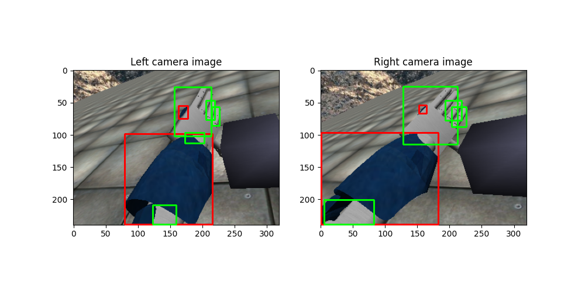

# Object Detection/segmentation Based On Thresholding 

The current algorithmus was designed to segment images in order to detect the arm of the robot as well as the object on the image

## Dependencies

 To run the algorithmus, the following <strong>libraries should be installed:</strong>

        <pre class="notranslate"><code> OpenCV >= 4.6.0 </code></pre> 

###  Installing OpenCV on Linux

<html>
<body>

This library can download from the source:
 

<ol>
    <li><i>Installing required packages and tools</i></li>
    <pre class="notranslate"><code> sudo apt install -y g++ cmake make git libgtk2.0-dev pkg-config  </code></pre> 
    <li><i>Download the source</i></li>
    <ul>
        <li> First of all, we need to clone the correspondently version of OpenCV. To find the all versions, visit this website and click on the GitHub icon of the latest version. </li>
        <li> On the GitHub page, copy the HTTPS link from the code button.</li>
        <li> On the terminal, type the following command </li>
                <pre class="notranslate"><code> git clone url </code></pre> 
            
paste the link using the shortcut key <mark> Ctrl + shift + v </mark>

    </ul>
    <li><i>Build the source</i></li>
    <ul>
        <li> Create the build directory and go into it using the following command: </li>
                    <pre class="notranslate"><code>  mkdir -p build && cd build </code></pre>
        <li> Generate the build scripts using cmake: </li>
            <pre class="notranslate"><code>  cmake ../opencv </code></pre>
        <li>  Build the source using make </li>
            <pre class="notranslate"><code>  make -j4 </code></pre>
    <li><i>Install the OpenCV packages </i></li>
        
 After the build process is completed, install the package. You will need sudo privileges to do so:

        <pre class="notranslate"><code>  sudo make install </code></pre>
            
</ol>

 If none error ist found, OpenCV is installed successfully on your Linux system. The header files could be found at the location 

        <pre class="notranslate"><code>/usr/local/include/opencv4</code></pre>

</body>
</html>

## Run 

Navigate to the file ./ThresholdingForSegmentation/, where the main.cpp file is placed. There, compile the important modules;

        g++ main.cpp objectDetector.cpp -o objectDetector ./directoryWalker/dirWalker.cpp -lstdc++fs `pkg-config --cflags --libs opencv`

Dont forget to use the links for filesystem -> -lstdc++fs und the one for the opencv libs `pkg-config --cflags --libs opencv`.

Once compilated, the file the command ./objectDetector should be excecuted 
    